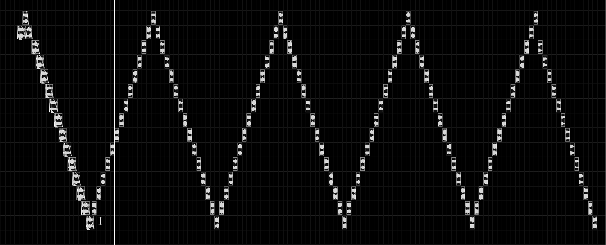
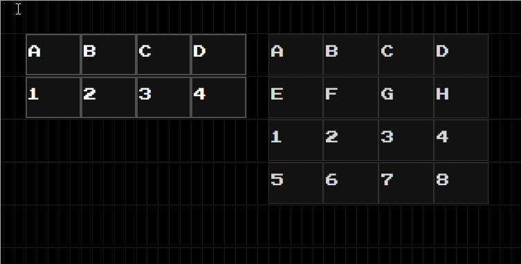
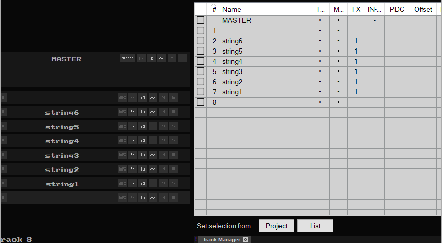
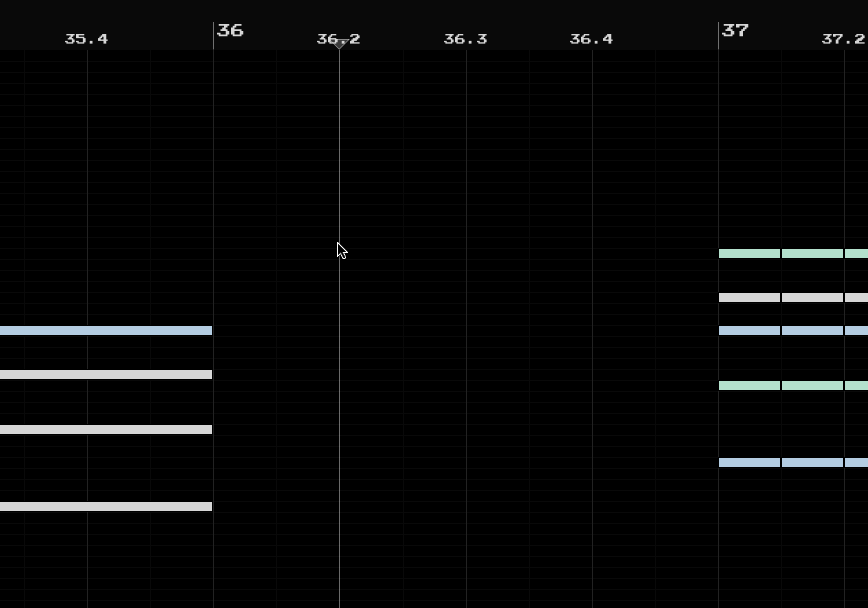
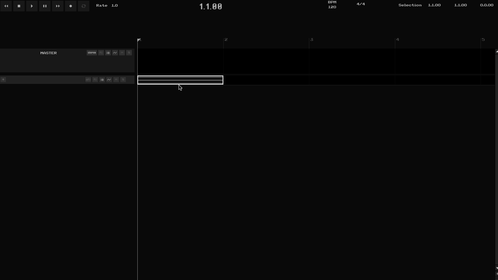
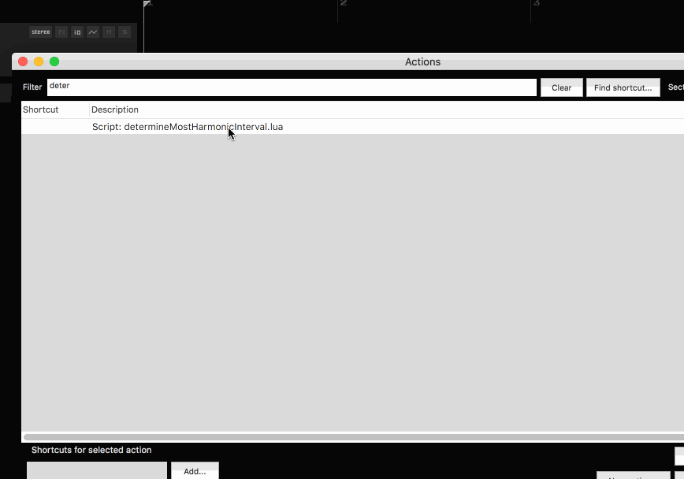

copyItemFades.lua / pasteItemFades.lua

transposeItems.lua

increasePlaybackOffset.lua / decreasePlaybackOffset.lua / resetPlaybackOffset.lua

insertMidiFromFretboard.lua

setNotesToBe9680.lua

determineMostHarmonicInterval.lua

